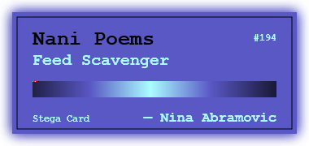

# Stega Carder

Hi there!
**Stega Carder** is a tool to encode any text into a cartridge-like image using [steganography](https://en.wikipedia.org/wiki/Steganography).
The *"stega card"* is perceived as a common .png image. It can therefore be viewed/uploaded anywhere.

This tool aim to offer a **refreshing and singular approach to share text**, code or even entire library, in an elegant way.

**Play with the tool here: https://vesamet.github.io/Stega-Carder/**

--------
This mini-project is heavily inspired by the **[Pico-8](https://www.lexaloffle.com/pico-8.php) fantasy console** and it's way to store game data. It basically extend the idea to every data that can fit in UTF-16

You can read more about it [here](https://pico-8.fandom.com/wiki/P8PNGFileFormat).

## Usage

### Online
- Visit the tool's website: **https://vesamet.github.io/Stega-Carder/** (hosted on Github Pages)
- Enter input text
- Design your cartridge (name, color, shadows, etc.)
- Download your *stega card*.

### Locally
Requires Node 14+ and yarn
- Clone this repository
- Open a terminal in the repository and issue this command: `yarn dev` 
- Visit `http://localhost:3000/` in your browser

*Note that the text isn't encrypted. Anyone with the tool can decode it. I do plan to add encryption eventually.*

This tool is built using [Nuxt](https://nuxtjs.org/) & [Vuetify](https://vuetifyjs.com).

## Contributing
Pull requests are welcome. For major changes, please open an issue first to discuss what you would like to change.

## License
[GPL v3](https://choosealicense.com/licenses/gpl-3.0/)
